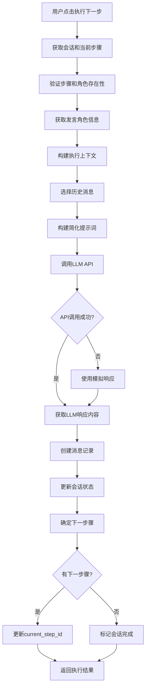
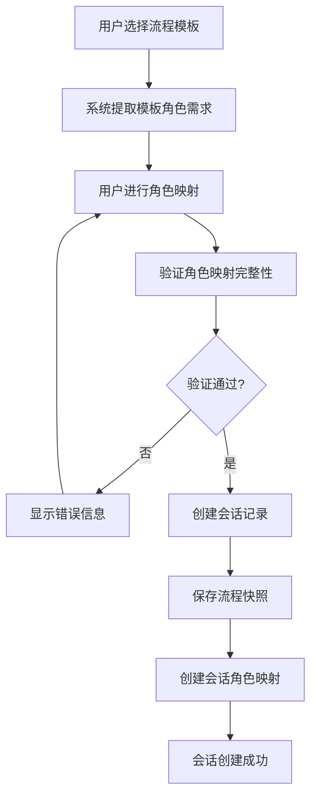
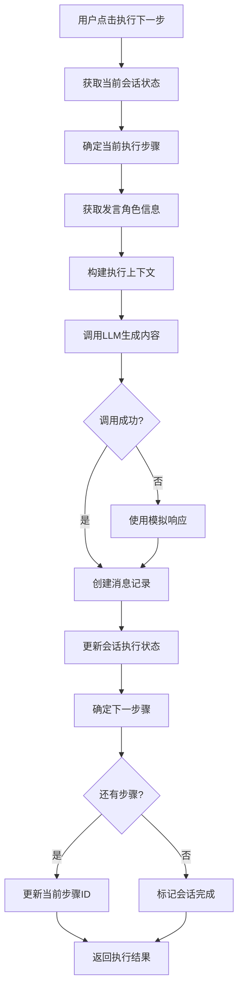

# 会话剧场 (Session Theater) 完整逻辑分析

## 📋 概述

会话剧场是一个高度智能化的多角色对话执行系统，将流程模板转换为交互式对话。它提供从模板选择到对话执行的完整生命周期，具备**无需角色映射的简化模式**和传统复杂模式，具有高级功能如智能角色识别、多类型上下文管理和实时分步执行。

## 🌟 核心创新

### 简化用户体验
- **零配置启动**: 选择流程模板 → 输入议题 → 开始对话
- **智能角色识别**: 自动匹配预定义角色，无需手动映射
- **自动会话启动**: 创建后立即进入可执行状态

### 技术架构升级
- **多模式支持**: 传统角色映射 + 无需角色映射双模式
- **多类型上下文**: 字符串、列表、字典格式全面支持
- **防御性编程**: 完整的类型验证和错误降级处理
- **智能错误恢复**: 自动处理数据类型不匹配问题

## 🔄 文档更新说明

**重要**: 本文档已根据实际代码实现进行以下关键修正：

### 1. **数据模型修正**
- `Session.user_id`: 确认为普通Integer字段（非ForeignKey）
- 明确`flow_snapshot_dict`和`roles_snapshot_dict`属性方法的存在
- 移除了不存在的cascade关系描述
- `Message.speaker_session_role_id`: 支持可空以适应无角色映射模式

### 2. **服务层实现修正**
- `SessionService.create_session`: 更新为实际实现，移除`current_step_id`初始化
- 使用`flow_snapshot_dict`属性而非直接字段操作
- 更新异常类型为`SessionNotFoundError`
- 新增`get_role_for_execution`方法支持直接角色名称匹配
- 无角色映射模式下自动创建临时SessionRole记录

### 3. **流程引擎架构修正**
- **关键修正**: `execute_next_step`（异步）是主方法，`execute_next_step_sync`仅为包装器
- 修正了文档中对方法优先级的错误描述
- 更新了实际的调用流程和事件循环处理
- **新增**: 智能上下文范围处理，支持字符串、列表、字典多种格式
- **新增**: 完整的类型验证和防御性编程机制

### 4. **API端点修正**
- 更新执行端点为实际路径：`POST /api/sessions/{id}/run-next-step`
- 修正为调用`execute_next_step(session_id)`异步方法
- 更新数据验证和Schema序列化描述
- 新增会话自动启动功能：创建后自动调用`start_session`

### 5. **前端实现修正**
- 消息渲染使用`msg.id`作为key（非`index`）
- 更新为实际的动态主题系统实现
- 修正了条件渲染逻辑
- **新增**: 智能角色映射检测，自动识别无需角色映射的流程类型
- **新增**: 无角色映射流程的简化UI界面

### 6. **错误修复记录**
- **修复**: `'str' object has no attribute 'get'` - 角色映射数据类型不匹配
- **修复**: `NOT NULL constraint failed` - 数据库字段约束问题
- **修复**: `unhashable type: 'list'` - 上下文范围处理中的列表作为字典键问题

---

---

## 🎯 1. 前端组件架构

### 1.1 SessionCreator 组件
**位置**: `fronted/src/MultiRoleDialogSystem.tsx:1173-1303`

#### 核心功能
- **模板选择**: 从API获取流程模板列表供用户选择
- **角色映射**: 自动或手动将模板角色映射到实际角色实例
- **表单验证**: 确保所有必填字段正确填写
- **会话创建**: 调用后端API创建新会话

#### 关键实现逻辑
```typescript
// 流程模板加载
const [flows, setFlows] = useState<FlowTemplate[]>([]);
useEffect(() => {
  flowApi.getFlows().then(res => setFlows(res.items));
}, []);

// 角色映射逻辑
const refs = Array.from(new Set((flow.steps || []).map(s => s.speaker_role_ref).filter(Boolean)));
setFormData(prev => ({
  ...prev,
  role_mappings: refs.map(ref => ({
    role_ref: ref,
    role_id: matchedRole ? matchedRole.id : ''
  }))
}));

// 会话创建API调用
const sessionData: CreateSessionRequest = {
  topic: formData.topic,
  flow_template_id: selectedFlow!.id,
  role_mappings: formData.role_mappings.reduce((acc, mapping) => {
    acc[mapping.role_ref] = Number(mapping.role_id);
    return acc;
  }, {} as Record<string, number>)
};
```

#### 用户界面结构
- **头部**: 创建向导标题和步骤指示器
- **模板选择**: 下拉列表显示可用流程模板
- **主题输入**: 文本框输入会话主题
- **角色映射**: 表格形式展示角色对应关系
- **操作按钮**: 创建和取消操作

### 1.2 SessionTheater 组件
**位置**: `fronted/src/MultiRoleDialogSystem.tsx:1305-1499`

#### 核心功能
- **实时消息显示**: 按时间顺序显示对话消息
- **分步执行控制**: 用户控制每一步的执行
- **会话状态管理**: 跟踪会话进度和状态
- **演员信息展示**: 侧边栏显示参与角色

#### 状态管理
```typescript
const [session, setSession] = useState<Session | null>(null);
const [messages, setMessages] = useState<Message[]>([]);
const [generating, setGenerating] = useState(false);
```

#### UI组件结构
- **头部区域**: 会话主题、状态徽章、模板ID、轮次计数器
- **侧边栏**: 角色演员列表（头像、名称、状态）
- **主对话区**: 内联消息气泡（角色头像、内容、时间戳）
- **控制面板**: 执行下一步、暂停、恢复、终止按钮
- **底部操作**: 导出、统计等额外功能

#### 消息显示逻辑
```typescript
// 实际的内联消息渲染实现（节选自 SessionTheater）
{messages.map(msg => {
  // 简化的角色判断逻辑，可以根据需要扩展
  const isTeacher = msg.speaker_role_name?.includes('老师') || false;
  // Dynamic bubble color for teacher
  const roleColor = isTeacher ? `${theme.bgSoft} ${theme.text}` : 'bg-gray-100 text-gray-900';
  return (
    <div key={msg.id} className={`flex gap-4 max-w-3xl`}>
      <div className="w-10 h-10 rounded-full bg-gray-200 flex items-center justify-center shrink-0 font-bold text-gray-600 text-sm">
        {msg.speaker_role_name?.[0] || '?'}
      </div>
      <div className="space-y-1">
        <div className="flex items-baseline gap-2">
          <span className="font-bold text-sm text-gray-900">{msg.speaker_role_name || '未知角色'}</span>
          <span className="text-xs text-gray-400">{new Date(msg.created_at).toLocaleTimeString()}</span>
          {msg.target_role_name && <span className="text-xs text-gray-400">to {msg.target_role_name}</span>}
        </div>
        <div className={`px-4 py-3 rounded-2xl rounded-tl-none ${roleColor} text-sm leading-relaxed shadow-sm`}>
          {msg.content}
        </div>
        <div className="flex gap-2 opacity-0 hover:opacity-100 transition-opacity">
          <button className={`text-xs ${theme.text} hover:underline flex items-center gap-1`}>
            <GitBranch size={10} /> 创建分支
          </button>
        </div>
      </div>
    </div>
  );
})}
```

**关键实现特征**：
- **Key属性**: 使用 `msg.id` 作为React key
- **主题系统**: 使用动态主题颜色 (`theme.bgSoft`, `theme.text`)
- **角色高亮**: 教师角色使用主题色高亮
- **消息气泡**: 支持动态颜色配置、阴影和分支创建入口

#### 执行控制逻辑
```typescript
// 执行下一步骤（SessionTheater 中的 handleNextStep）
const handleNextStep = async () => {
  if (!session) return;
  setGenerating(true);
  try {
    // 调用真实的API执行下一步
    const result = await sessionApi.executeNextStep(session.id);

    // 添加新消息到消息列表
    if (result.message) {
      setMessages(prev => [...prev, result.message]);
    }

    // 更新会话状态（如果后端返回了更新的会话信息）
    if (result.execution_info && result.execution_info.is_finished) {
      setSession(prev => prev ? {
        ...prev,
        status: 'finished',
        updated_at: new Date().toISOString()
      } : null);
    }
  } catch (error) {
    handleError(error);
  } finally {
    setGenerating(false);
  }
};
```

---

## 🔄 2. 流程模板Step机制深度解析

### 2.1 FlowTemplate和FlowStep的关系结构

#### FlowTemplate模型
**位置**: `backend/app/models/flow.py`

```python
class FlowTemplate(db.Model):
    id = db.Column(db.Integer, primary_key=True)
    name = db.Column(db.String(200), nullable=False)
    topic = db.Column(db.String(200), nullable=True)
    type = db.Column(db.String(50), nullable=False)
    description = db.Column(db.Text, nullable=True)
    version = db.Column(db.String(20), nullable=True)
    is_active = db.Column(db.Boolean, nullable=True, default=None)
    _termination_config = db.Column('termination_config', db.Text, nullable=True)
    created_at = db.Column(db.DateTime, default=datetime.utcnow)
    updated_at = db.Column(db.DateTime, default=datetime.utcnow, onupdate=datetime.utcnow)

    # 关系：所有步骤按order排序
    steps = db.relationship('FlowStep', lazy='dynamic', order_by='FlowStep.order')
```

#### FlowStep模型
**位置**: `backend/app/models/flow.py`

```python
class FlowStep(db.Model):
    # 基本字段
    id = db.Column(db.Integer, primary_key=True)
    flow_template_id = db.Column(db.Integer, db.ForeignKey('flow_templates.id'), nullable=False)
    order = db.Column(db.Integer, nullable=False)  # 步骤顺序

    # 角色配置
    speaker_role_ref = db.Column(db.String(50), nullable=False)  # 发言角色引用
    target_role_ref = db.Column(db.String(50), nullable=True)    # 目标角色引用

    # 任务配置
    task_type = db.Column(db.String(50), nullable=False)          # 任务类型
    description = db.Column(db.String(500), nullable=True)       # 任务描述

    # 上下文配置
    _context_scope = db.Column('context_scope', db.Text, nullable=False)
    _context_param = db.Column('context_param', db.Text, nullable=True)

    # 逻辑配置（包含循环配置）
    _logic_config = db.Column('logic_config', db.Text, nullable=True)

    # 流程控制
    next_step_id = db.Column(db.Integer, db.ForeignKey('flow_steps.id'), nullable=True)
```

### 2.2 Step结合机制

#### 步骤执行顺序
```python
# 顺序执行机制
steps = flow_template.steps.order_by(FlowStep.order).all()

# 示例数据结构
{
  "flow_template": {
    "id": 1,
    "name": "教学对话模板",
    "steps": [
      {
        "id": 1,
        "order": 1,
        "speaker_role_ref": "teacher",
        "target_role_ref": "student",
        "task_type": "ask_question",
        "description": "向学生提问"
      },
      {
        "id": 2,
        "order": 2,
        "speaker_role_ref": "student",
        "target_role_ref": "teacher",
        "task_type": "answer_question",
        "description": "回答老师的问题"
      }
    ]
  }
}
```

#### 步骤推进逻辑
**位置**: `backend/app/services/flow_engine_service.py:_determine_next_step`

```python
@staticmethod
def _determine_next_step(session: Session, current_step: FlowStep) -> Optional[int]:
    """
    确定下一步骤ID

    Args:
        session: 会话对象
        current_step: 当前步骤

    Returns:
        Optional[int]: 下一步骤ID，如果没有则返回None
    """
    # 获取流程模板的所有步骤
    flow_template = FlowTemplate.query.get(session.flow_template_id)
    if not flow_template:
        return None

    all_steps = flow_template.steps.order_by(FlowStep.order).all()

    # 查找当前步骤在列表中的位置
    current_index = None
    for i, step in enumerate(all_steps):
        if step.id == current_step.id:
            current_index = i
            break

    if current_index is None:
        return None

    # 检查是否有下一步骤
    if current_index < len(all_steps) - 1:
        return all_steps[current_index + 1].id

    # 检查循环配置
    loop_config = current_step.loop_config_dict
    if loop_config.get('enabled', False):
        max_loops = loop_config.get('max_loops', 1)
        if session.current_round < max_loops:
            # 返回循环开始步骤
            loop_start_step_ref = loop_config.get('loop_start_role_ref')
            if loop_start_step_ref:
                for step in all_steps:
                    if step.speaker_role_ref == loop_start_step_ref:
                        return step.id
            # 如果没有指定循环开始，返回第一个步骤
            return all_steps[0].id if all_steps else None

    return None
```

### 2.3 发言者提示词组装机制

#### 角色信息获取
```python
# Role模型结构
class Role(db.Model):
    id = db.Column(db.Integer, primary_key=True)
    name = db.Column(db.String(100), nullable=False, unique=True)
    prompt = db.Column(db.Text, nullable=False)  # 统一字段，包含所有角色信息
```

#### 复杂版提示词构建（保留版本）
**位置**: `backend/app/services/flow_engine_service.py:_build_prompt`

```python
@staticmethod
def _build_prompt(role: Role, step: FlowStep, context: Dict[str, Any]) -> str:
    # 角色信息
    role_info = f"""
你是{role.name}。
角色描述：{role.description}
发言风格：{role.style}
关注点：{', '.join(role.focus_points_list)}
""".strip()

    # 任务信息
    task_info = f"""
任务类型：{step.task_type}
任务描述：{step.description if step.description else '无'}
""".strip()

    # 上下文信息
    context_info = f"""
会话主题：{context['session_topic']}
当前轮次：{context['current_round']}
已执行步骤数：{context['step_count']}
""".strip()

    # 历史消息
    history_info = ""
    if context['history_messages']:
        history_info = "\n之前的对话：\n"
        for msg in context['history_messages']:
            speaker = msg['speaker_role'] or '未知角色'
            content = msg['content'][:100] + "..." if len(msg['content']) > 100 else msg['content']
            history_info += f"{speaker}: {content}\n"

    # 组合完整提示词
    prompt = f"""{role_info}

{task_info}

{context_info}

{history_info}

请根据你的角色设定和当前任务，发表你的观点。"""

    return prompt
```

#### 简化版提示词构建（当前使用）
**位置**: `backend/app/services/flow_engine_service.py:_build_simple_prompt`

```python
@staticmethod
def _build_simple_prompt(role: Role, step: FlowStep, context: Dict[str, Any]) -> str:
    prompt_parts = []

    # 基本角色信息
    if role and hasattr(role, 'name'):
        role_desc = f"你是{role.name}"
        if hasattr(role, 'prompt') and role.prompt:
            role_desc += f"。{role.prompt}"
        prompt_parts.append(role_desc)

    # 会话主题
    session_topic = context.get('session_topic', '')
    if session_topic:
        prompt_parts.append(f"会话主题：{session_topic}")

    # 当前任务
    if step:
        task_desc = step.description if step.description else step.task_type
        prompt_parts.append(f"任务：{task_desc}")

    # 当前轮次信息
    current_round = context.get('current_round', 1)
    step_count = context.get('step_count', 0)
    prompt_parts.append(f"第{current_round}轮对话，第{step_count + 1}个步骤")

    # 简单的指令
    prompt_parts.append("请以该角色的身份进行回应。")

    return " ".join(prompt_parts)
```

### 2.4 上下文管理机制

#### 上下文范围配置
**位置**: `backend/app/services/flow_engine_service.py:_select_context_messages`

```python
@staticmethod
def _select_context_messages(session: Session, current_step: FlowStep) -> List[Message]:
    base_query = Message.query.filter_by(session_id=session.id)

    # 根据上下文范围选择消息
    if current_step.context_scope == 'none':
        return []

    elif current_step.context_scope == 'last_message':
        return base_query.order_by(Message.created_at.desc()).limit(1).all()

    elif current_step.context_scope == 'last_round':
        return base_query.filter(
            Message.round_index == session.current_round - 1
        ).order_by(Message.created_at.asc()).all()

    elif current_step.context_scope == 'last_n_messages':
        n = current_step.context_param.get('n', 5)
        return base_query.order_by(Message.created_at.desc()).limit(n).all()

    elif current_step.context_scope == 'all':
        return base_query.order_by(Message.created_at.asc()).all()

    # 支持角色筛选
    else:
        # 构建角色名称到会话角色ID的映射
        role_name_to_session_ids = {}
        session_roles = SessionService.get_role_mapping(session.id)
        for role_ref, role_info in session_roles.items():
            role_name_to_session_ids[role_ref] = role_info.get('session_role_id')

        role_names = []
        try:
            # 尝试解析为JSON数组
            parsed_scope = json.loads(current_step.context_scope) if current_step.context_scope else []
            if isinstance(parsed_scope, list):
                role_names = [name for name in parsed_scope if name in role_name_to_session_ids]
        except (json.JSONDecodeError, TypeError):
            # 处理单个角色名称
            if current_step.context_scope in role_name_to_session_ids:
                role_names = [current_step.context_scope]

        # 筛选特定角色的消息
        if role_names:
            all_session_role_ids = []
            for role_name in role_names:
                all_session_role_ids.extend(role_name_to_session_ids[role_name])

            return base_query.filter(
                Message.speaker_session_role_id.in_(all_session_role_ids)
            ).order_by(Message.created_at.asc()).all()

        return []
```

#### 上下文构建流程
```python
@staticmethod
def _build_context(session: Session, current_step: FlowStep) -> Dict[str, Any]:
    # 获取会话角色映射
    session_roles = SessionService.get_role_mapping(session.id)

    # 获取历史消息
    history_messages = FlowEngineService._select_context_messages(session, current_step)

    # 构建完整上下文
    context = {
        'session_topic': session.topic,
        'current_round': session.current_round,
        'step_count': session.executed_steps_count,
        'session_roles': session_roles,
        'history_messages': [msg.to_dict() for msg in history_messages],
        'flow_template': {
            'id': session.flow_template_id,
            'name': session.flow_template.name if session.flow_template else None,
            'total_steps': len(session.flow_template.steps.all()) if session.flow_template else 0
        }
    }

    return context
```

### 2.5 流转逻辑机制

#### 退出条件 + 循环配置结构
```python
@staticmethod
def _determine_next_step(session: Session, current_step: FlowStep) -> Optional[int]:
    """
    确定下一步骤ID，支持：
    1）基于LLM结构化输出的退出条件（exit_condition）
    2）线性推进（order）
    3）基于loop_config的循环控制
    """
    # 1. 优先检查退出条件：若满足则直接结束会话
    if FlowEngineService._check_exit_condition(session, current_step):
        return None

    # 2. 获取流程模板的所有步骤
    flow_template = FlowTemplate.query.get(session.flow_template_id)
    if not flow_template:
        return None

    all_steps = flow_template.steps.order_by(FlowStep.order).all()

    # 3. 查找当前步骤在列表中的位置
    current_index = None
    for i, step in enumerate(all_steps):
        if step.id == current_step.id:
            current_index = i
            break

    if current_index is None:
        return None

    # 4. 默认线性推进
    if current_index < len(all_steps) - 1:
        return all_steps[current_index + 1].id

    # 5. 检查循环配置（仅在到达最后一步且未满足退出条件时生效）
    loop_config = current_step.loop_config_dict
    if loop_config.get('enabled', False):
        max_loops = loop_config.get('max_loops', 1)
        if session.current_round < max_loops:
            # 返回循环开始步骤
            loop_start_step_ref = loop_config.get('loop_start_role_ref')
            if loop_start_step_ref:
                for step in all_steps:
                    if step.speaker_role_ref == loop_start_step_ref:
                        return step.id
            # 如果没有指定循环开始，返回第一个步骤
            return all_steps[0].id if all_steps else None

    return None  # 结束会话
```

**重要前提**：
- **模板前提**: 流程模板必须至少包含一个步骤，否则无法创建会话
- **退出条件优先级**: 若配置了 `exit_condition` 且满足，则无论后面是否还有步骤或循环，都直接结束会话
- **循环配置默认值**: `enabled=False`，`max_loops=1` 确保不会无限循环

#### 退出条件检查机制
```python
@staticmethod
def _check_exit_condition(session: Session, current_step: FlowStep) -> bool:
    """
    检查当前步骤是否满足退出条件

    当前主要支持基于LLM结构化输出的退出条件：
    - type: 'llm_accept_flag'
      要求当前步骤对应的发言内容是JSON，并包含布尔字段 `accept`
      当 accept 为 True 时视为满足退出条件
    """
    logic_config = current_step.logic_config or {}
    exit_config = logic_config.get('exit_condition') if isinstance(logic_config, dict) else None

    if not exit_config or not isinstance(exit_config, dict):
        return False

    condition_type = exit_config.get('type')

    # 基于LLM输出的接受标志
    if condition_type == 'llm_accept_flag':
        speaker_role_ref = current_step.speaker_role_ref
        if not speaker_role_ref:
            return False

        speaker_session_role = SessionService.get_session_role_by_ref(session.id, speaker_role_ref)
        if not speaker_session_role:
            return False

        # 获取该角色在本会话中最新的一条消息（通常就是刚刚生成的这条）
        last_message = (
            Message.query
            .filter_by(session_id=session.id, speaker_session_role_id=speaker_session_role.id)
            .order_by(Message.created_at.desc())
            .first()
        )
        if not last_message or not last_message.content:
            return False

        # 尝试将消息内容解析为JSON，并读取accept字段
        try:
            data = json.loads(last_message.content)
            accept_value = data.get('accept')
            return bool(accept_value is True)
        except (json.JSONDecodeError, TypeError, ValueError):
            # 非JSON或没有accept字段，则认为未满足退出条件
            return False

    # 其他类型的退出条件可以在此扩展
    return False
```

#### 状态更新机制
```python
@staticmethod
def _update_session_after_step_execution(session: Session, executed_step: FlowStep) -> None:
    # 更新执行计数
    session.executed_steps_count += 1
    session.updated_at = datetime.utcnow()

    # 检查是否需要进入下一轮
    if FlowEngineService._should_start_new_round(session, executed_step):
        session.current_round += 1

    # 确定下一步骤
    next_step_id = FlowEngineService._determine_next_step(session, executed_step)
    if next_step_id:
        session.current_step_id = next_step_id
    else:
        # 没有下一步骤，结束会话
        session.status = 'finished'
        session.ended_at = datetime.utcnow()

@staticmethod
def _should_start_new_round(session: Session, step: FlowStep) -> bool:
    """判断是否应该开始新的轮次"""
    # 简单的逻辑：当执行到总结类型的步骤时，开始新轮次
    return step.task_type in ['summarize', 'conclude']
```

#### 循环控制示例
```python
# 循环配置示例
loop_config = {
    "enabled": True,               # 启用循环
    "max_loops": 1,                # 最大循环1次
    "loop_start_role_ref": "teacher"   # 循环开始角色（可选）
}

# 会话轮次管理
# 轮次语义说明：
# - Session.current_round: 0表示"未开始"，第一轮对话时设为1
# - Message.round_index: 从1开始，表示具体的对话轮次
# - 轮次推进：当特定条件满足时（如总结类任务），current_round递增
class Session(db.Model):
    current_round = db.Column(db.Integer, default=0)  # 当前轮次（0=未开始，1=第一轮）
    executed_steps_count = db.Column(db.Integer, default=0)  # 已执行步骤数
```

### 2.6 完整的步骤执行流程



### 2.7 核心代码实现

#### 主执行方法
**位置**: `backend/app/services/flow_engine_service.py:execute_next_step`

```python
@staticmethod
async def execute_next_step(session_id: int) -> Tuple[Message, Dict[str, Any]]:
    """异步版本的执行下一步骤（主要实现）"""
    # 实际的核心业务逻辑在异步方法中实现
    # 包括：获取会话、构建上下文、调用LLM、创建消息、更新状态等
```

#### 兼容性包装方法
**位置**: `backend/app/services/flow_engine_service.py:execute_next_step_sync`

```python
@staticmethod
def execute_next_step_sync(session_id: int) -> Tuple[Message, Dict[str, Any]]:
    """
    同步版本的执行下一步骤（用于向后兼容）
    实际上是异步execute_next_step方法的包装器
    """
    try:
        # 检查是否在事件循环中运行
        try:
            loop = asyncio.get_event_loop()
            if loop.is_running():
                # 如果循环正在运行，在新线程中运行异步方法
                import concurrent.futures
                with concurrent.futures.ThreadPoolExecutor() as executor:
                    future = executor.submit(asyncio.run, FlowEngineService.execute_next_step(session_id))
                    return future.result()
            else:
                # 如果循环存在但未运行，直接使用
                return loop.run_until_complete(FlowEngineService.execute_next_step(session_id))
        except RuntimeError:
            # 没有事件循环，创建新的
            return asyncio.run(FlowEngineService.execute_next_step(session_id))

    except Exception as e:
        if isinstance(e, (SessionError, FlowExecutionError)):
            raise
        raise FlowExecutionError(f"执行步骤失败: {str(e)}")
```

**重要架构说明**：
- **主要方法**: `execute_next_step` 是包含完整业务逻辑的异步主方法
- **包装方法**: `execute_next_step_sync` 仅是向后兼容的同步包装器
- **调用方式**: API层调用的是 `execute_next_step(session_id)` 异步方法

---

## 🚀 2. 无需角色映射的简化流程

### 2.1 功能概述
**无需角色映射模式**是对传统多角色对话系统的重大简化，允许用户直接使用预定义角色进行对话，无需手动配置复杂的角色映射关系。

#### 核心特性
- **智能识别**: 系统自动识别流程类型（`business_discussion`、`simple`等）
- **自动配置**: 无需手动选择角色实例，系统自动匹配
- **简化UI**: 用户只需选择流程模板和输入议题
- **一键启动**: 创建会话后自动进入可执行状态

### 2.2 前端智能检测
**位置**: `fronted/src/MultiRoleDialogSystem.tsx:1200-1220`

```typescript
// 智能检测流程类型
useEffect(() => {
  if (formData.flow_template_id && flows.length > 0) {
    const flow = flows.find(f => f.id === Number(formData.flow_template_id));
    if (flow) {
      const refs = Array.from(new Set((flow.steps || []).map(s => s.speaker_role_ref).filter(Boolean)));
      setRequiredRoles(refs);
      if (flow.topic) setFormData(prev => ({ ...prev, topic: flow.topic || '' }));

      // 检查是否是无需角色映射的流程
      const needsMapping = !flow.type?.includes('simple') &&
                         !flow.type?.includes('business_discussion') &&
                         refs.length > 0;
      setNeedsRoleMapping(needsMapping);

      if (needsMapping) {
        // 传统模式：需要手动角色映射
        setFormData(prev => ({
          ...prev,
          role_mappings: refs.map(ref => {
            const matchedRole = roles.find(r => r.name === ref);
            return { role_ref: ref, role_id: matchedRole ? matchedRole.id : '' };
          })
        }));
      } else {
        // 简化模式：自动角色配置
        setFormData(prev => ({ ...prev, role_mappings: [] }));
      }
    }
  }
}, [formData.flow_template_id, flows, roles]);
```

### 2.3 后端自动处理

#### 角色查找服务
**位置**: `backend/app/services/session_service.py:450-475`

```python
@staticmethod
def get_role_for_execution(session_id: int, role_ref: str) -> Optional[Role]:
    """
    获取执行步骤时需要的角色对象
    支持有角色映射和无角色映射两种模式
    """
    # 1. 首先尝试从会话角色映射中获取
    session_role = SessionService.get_session_role_by_ref(session_id, role_ref)
    if session_role and session_role.role:
        return session_role.role

    # 2. 直接通过角色名称查找（无角色映射模式）
    role = Role.query.filter_by(name=role_ref).first()
    if role:
        return role

    # 3. 模糊匹配（降级处理）
    role = Role.query.filter(Role.name.contains(role_ref)).first()
    return role
```

#### 临时SessionRole创建
**位置**: `backend/app/services/flow_engine_service.py:52-63`

```python
# 如果没有session_role，创建一个临时的SessionRole记录
if not speaker_session_role:
    temp_session_role = SessionRole(
        session_id=session_id,
        role_ref=current_step.speaker_role_ref,
        role_id=role.id
    )
    db.session.add(temp_session_role)
    db.session.flush()  # 获取ID
    speaker_session_role = temp_session_role
```

### 2.4 智能上下文范围处理
**位置**: `backend/app/services/flow_engine_service.py:198-296`

#### 多类型上下文支持
系统现在支持以下上下文范围格式：

1. **基础范围**（字符串）
   - `'none'` - 无历史消息
   - `'last_message'` - 最后一条消息
   - `'last_round'` - 上一轮次消息
   - `'last_n_messages'` - 最后N条消息
   - `'all'` - 所有历史消息

2. **多角色筛选**（字符串数组/JSON）
   ```json
   ["Product Manager", "Engineer", "Designer"]
   ```

3. **列表类型**（直接数组）
   ```python
   scope = ["Product Manager", "Engineer"]
   ```

4. **字典类型**（预留扩展）
   ```python
   scope = {"include": ["PM", "Dev"], "exclude": ["QA"]}
   ```

#### 类型安全处理
```python
# 智能类型检测和安全处理
if isinstance(scope, str):
    # 字符串处理逻辑
elif isinstance(scope, list):
    # 列表类型：确保只使用字符串
    role_names = [
        name for name in scope
        if isinstance(name, str) and name in role_name_to_session_ids
    ]
elif isinstance(scope, dict):
    # 字典类型：使用key作为角色名列表
    role_names = [
        name for name in scope.keys()
        if isinstance(name, str) and name in role_name_to_session_ids
    ]
```

### 2.5 前端UI适配

#### 自动角色配置界面
```typescript
{/* 无需角色映射时的UI */}
{!needsRoleMapping && requiredRoles.length > 0 && (
  <div className={`p-4 rounded-lg border ${theme.bgSoft} ${theme.border}`}>
    <h3 className={`font-bold ${theme.text} mb-3 flex items-center gap-2`}>
      <CheckCircle size={18}/> 自动角色配置
    </h3>
    <div className="space-y-2">
      <p className={`text-sm ${theme.text} opacity-80`}>
        此流程将自动使用以下角色参与讨论：
      </p>
      <div className="flex flex-wrap gap-2">
        {requiredRoles.map(ref => (
          <span key={ref} className={`px-3 py-1 rounded-full text-xs font-medium ${theme.bgPrimary} ${theme.textPrimary}`}>
            {ref}
          </span>
        ))}
      </div>
      <p className={`text-xs ${theme.text} mt-2 opacity-70`}>
        * 系统将自动匹配对应的角色配置
      </p>
    </div>
  </div>
)}
```

---

## 🔧 3. 后端服务架构

### 3.1 SessionService
**位置**: `backend/app/services/session_service.py`

#### 核心职责
- **会话生命周期管理**: 创建、启动、暂停、恢复、终止会话
- **角色映射验证**: 确保模板角色正确映射到实际角色
- **状态持久化**: 维护会话状态和执行进度

#### 关键方法实现

##### 会话创建
```python
@staticmethod
def create_session(session_data: Dict[str, Any]) -> Session:
    """
    创建新的会话

    Args:
        session_data: 会话数据，包含topic, flow_template_id, role_mappings等

    Returns:
        Session: 创建的会话对象

    Raises:
        SessionNotFoundError: 会话不存在错误
        RoleMappingError: 角色映射错误
        SessionError: 会话创建失败
    """
    try:
        # 验证流程模板是否存在
        flow_template = FlowTemplate.query.get(session_data['flow_template_id'])
        if not flow_template:
            raise SessionNotFoundError(f"流程模板ID {session_data['flow_template_id']} 不存在")

        # 验证角色映射
        role_mappings = session_data['role_mappings']
        SessionService._validate_role_mappings(flow_template, role_mappings)

        # 创建会话（注意：不设置 current_step_id）
        session = Session(
            user_id=session_data.get('user_id'),
            topic=session_data['topic'],
            flow_template_id=session_data['flow_template_id'],
            status='not_started',
            current_round=0,
            executed_steps_count=0
            # 注意：创建时不设置 current_step_id
        )

        # 保存流程模板快照
        session.flow_snapshot_dict = flow_template.to_dict(include_steps=True)

        db.session.add(session)
        db.session.flush()  # 获取会话ID

        # 创建会话角色映射
        SessionService._create_session_roles(session.id, role_mappings)

        # 保存角色快照
        session.roles_snapshot_dict = SessionService._create_roles_snapshot(role_mappings)

        db.session.commit()
        return session

    except Exception as e:
        db.session.rollback()
        if isinstance(e, SessionError):
            raise
        raise SessionError(f"创建会话失败: {str(e)}")
```

##### 角色映射验证
```python
@staticmethod
def _validate_role_mappings(flow_template: FlowTemplate, role_mappings: Dict[str, int]):
    template_roles = set()
    for step in flow_template.steps:
        template_roles.add(step.speaker_role_ref)
        if step.target_role_ref:
            template_roles.add(step.target_role_ref)

    missing_roles = template_roles - set(role_mappings.keys())
    if missing_roles:
        raise SessionError(f"缺少角色映射: {', '.join(missing_roles)}")

    # 验证角色ID是否存在
    for role_ref, role_id in role_mappings.items():
        role = Role.query.get(role_id)
        if not role:
            raise SessionError(f"角色ID {role_id} 不存在")
```

### 3.2 FlowEngineService
**位置**: `backend/app/services/flow_engine_service.py`

#### 核心职责
- **流程执行引擎**: 按步骤执行对话流程
- **上下文构建**: 为LLM调用构建上下文信息
- **消息生成**: 调用LLM生成角色对话内容
- **状态推进**: 管理会话执行进度

#### 关键修改（已实现HTTP API方式调用）

##### LLM调用方式（修改后）
```python
@staticmethod
def _generate_llm_response_sync(role: Role, step: FlowStep, context: Dict[str, Any], llm_provider: str = None) -> str:
    try:
        # 构建简单的提示词，类似LLM测试页面
        prompt = FlowEngineService._build_simple_prompt(role, step, context)

        # 构建历史消息
        history_messages = []
        history = context.get('history_messages', [])

        # 添加历史消息到history数组
        for msg in history[-10:]:  # 只取最近10条消息避免上下文过长
            role_name = msg.get('speaker_role', '用户')
            content = msg.get('content', '')
            if content:
                msg_role = 'assistant' if role_name != '用户' else 'user'
                history_messages.append({
                    'role': msg_role,
                    'content': f"{role_name}: {content}"
                })

        # 调用简单的 /api/llm/chat 端点
        api_url = 'http://localhost:5010/api/llm/chat'
        payload = {
            'message': prompt,
            'history': history_messages,
            'provider': llm_provider
        }

        response = requests.post(api_url, json=payload, headers={'Content-Type': 'application/json'}, timeout=30)

        if response.status_code == 200:
            result = response.json()
            if result.get('success') and 'data' in result:
                return result['data']['response']
            else:
                raise FlowExecutionError(f"LLM API返回错误: {result.get('message', '未知错误')}")
        else:
            raise FlowExecutionError(f"LLM API请求失败，状态码: {response.status_code}")

    except requests.exceptions.RequestException as e:
        # 网络请求失败，回退到模拟模式
        logger.warning(f"LLM API请求失败，使用模拟响应: {str(e)}")
        return FlowEngineService._build_simple_prompt(role, step, context)
```

##### 简化提示词构建
```python
@staticmethod
def _build_simple_prompt(role: Role, step: FlowStep, context: Dict[str, Any]) -> str:
    prompt_parts = []

    # 基本角色信息
    if role and hasattr(role, 'name'):
        role_desc = f"你是{role.name}"
        if hasattr(role, 'prompt') and role.prompt:
            role_desc += f"。{role.prompt}"
        elif hasattr(role, 'description') and role.description:
            role_desc += f"。描述：{role.description}"
        prompt_parts.append(role_desc)

    # 会话主题
    session_topic = context.get('session_topic', '')
    if session_topic:
        prompt_parts.append(f"会话主题：{session_topic}")

    # 当前任务
    if step:
        task_desc = step.description if step.description else step.task_type
        prompt_parts.append(f"任务：{task_desc}")

    # 当前轮次信息
    current_round = context.get('current_round', 1)
    step_count = context.get('step_count', 0)
    prompt_parts.append(f"第{current_round}轮对话，第{step_count + 1}个步骤")

    # 简单的指令
    prompt_parts.append("请以该角色的身份进行回应。")

    return " ".join(prompt_parts)
```

##### 步骤执行流程
```python
@staticmethod
def execute_next_step_sync(session_id: int) -> Tuple[Message, Dict[str, Any]]:
    try:
        # 获取会话和当前步骤
        session = Session.query.get(session_id)
        if not session:
            raise SessionError("会话不存在")

        current_step = FlowEngineService._get_current_step(session)
        if not current_step:
            raise SessionError("没有可执行的步骤")

        # 获取发言角色
        speaker_session_role = SessionService.get_session_role_by_ref(session_id, current_step.speaker_role_ref)
        if not speaker_session_role:
            raise SessionError(f"发言角色 {current_step.speaker_role_ref} 不存在")

        role = speaker_session_role.role

        # 构建上下文
        context = FlowEngineService._build_context(session, current_step)

        # 生成LLM响应
        content = FlowEngineService._generate_llm_response_sync(role, current_step, context)

        # 创建消息
        message = FlowEngineService._create_message(session, current_step, speaker_session_role, content, context)

        # 更新会话状态
        FlowEngineService._update_session_after_step_execution(session, current_step)

        # 构建执行信息
        execution_info = FlowEngineService._build_execution_info(session, current_step)

        db.session.commit()
        return message, execution_info

    except Exception as e:
        db.session.rollback()
        raise FlowExecutionError(f"执行步骤失败: {str(e)}")
```

### 3.3 MessageService
**位置**: `backend/app/services/message_service.py`

#### 核心职责
- **消息CRUD操作**: 创建、查询、更新、删除消息
- **消息分页**: 支持大规模消息的分页查询
- **消息搜索**: 按内容、角色、时间等条件搜索
- **消息统计**: 提供消息相关的统计信息

---

## 📊 4. 数据模型设计

### 4.1 Session 模型
**位置**: `backend/app/models/session.py`

```python
class Session(db.Model):
    """会话模型"""
    __tablename__ = 'sessions'

    id = db.Column(db.Integer, primary_key=True)
    user_id = db.Column(db.Integer)  # 用户ID，暂未实现用户系统（注意：是普通Integer字段，非外键）
    topic = db.Column(db.String(200), nullable=False)  # 会话主题
    flow_template_id = db.Column(db.Integer, db.ForeignKey('flow_templates.id'), nullable=False)
    flow_snapshot = db.Column(db.Text)  # 流程模板快照，JSON格式
    roles_snapshot = db.Column(db.Text)  # 参与角色快照，JSON格式
    status = db.Column(db.String(20), default='not_started')  # not_started/running/paused/finished/failed
    current_step_id = db.Column(db.Integer)  # 当前步骤ID
    current_round = db.Column(db.Integer, default=0)  # 当前轮次
    executed_steps_count = db.Column(db.Integer, default=0)  # 已执行步骤数
    error_reason = db.Column(db.String(500))  # 错误原因
    created_at = db.Column(db.DateTime, default=datetime.utcnow)
    updated_at = db.Column(db.DateTime, default=datetime.utcnow, onupdate=datetime.utcnow)
    ended_at = db.Column(db.DateTime)

    # 关系
    flow_template = db.relationship('FlowTemplate', backref='sessions')
    session_roles = db.relationship('SessionRole', backref='session', lazy='dynamic')
    messages = db.relationship('Message', backref='session', lazy='dynamic',
                              order_by='Message.created_at')

    # 属性方法
    @property
    def flow_snapshot_dict(self):
        """获取流程快照字典"""
        if self.flow_snapshot:
            try:
                return json.loads(self.flow_snapshot)
            except (json.JSONDecodeError, TypeError):
                return {}
        return {}

    @flow_snapshot_dict.setter
    def flow_snapshot_dict(self, value):
        """设置流程快照"""
        if isinstance(value, dict):
            self.flow_snapshot = json.dumps(value, ensure_ascii=False)
        else:
            self.flow_snapshot = value

    @property
    def roles_snapshot_dict(self):
        """获取角色快照字典"""
        if self.roles_snapshot:
            try:
                return json.loads(self.roles_snapshot)
            except (json.JSONDecodeError, TypeError):
                return {}
        return {}

    @roles_snapshot_dict.setter
    def roles_snapshot_dict(self, value):
        """设置角色快照"""
        if isinstance(value, dict):
            self.roles_snapshot = json.dumps(value, ensure_ascii=False)
        else:
            self.roles_snapshot = value
```

#### 状态枚举
- `not_started`: 已创建但未开始
- `running`: 正在执行
- `paused`: 临时暂停
- `finished`: 成功完成
- `failed`: 执行失败
- `terminated`: 强制终止

### 4.2 SessionRole 模型
**位置**: `backend/app/models/session.py`

```python
class SessionRole(db.Model):
    """会话角色模型"""
    __tablename__ = 'session_roles'

    id = db.Column(db.Integer, primary_key=True)
    session_id = db.Column(db.Integer, db.ForeignKey('sessions.id'), nullable=False)
    role_ref = db.Column(db.String(50), nullable=False)  # 模板内角色引用
    role_id = db.Column(db.Integer, db.ForeignKey('roles.id'), nullable=False)  # 实际角色ID
    created_at = db.Column(db.DateTime, default=datetime.utcnow)

    # 关系
    role = db.relationship('Role')
    sent_messages = db.relationship('Message', foreign_keys='Message.speaker_session_role_id')
    target_messages = db.relationship('Message', foreign_keys='Message.target_session_role_id')
```

### 4.3 Message 模型
**位置**: `backend/app/models/message.py`

```python
class Message(db.Model):
    """消息模型"""
    __tablename__ = 'messages'

    id = db.Column(db.Integer, primary_key=True)
    session_id = db.Column(db.Integer, db.ForeignKey('sessions.id'), nullable=False)
    speaker_session_role_id = db.Column(db.Integer, db.ForeignKey('session_roles.id'), nullable=False)
    target_session_role_id = db.Column(db.Integer, db.ForeignKey('session_roles.id'))  # 目标角色ID
    reply_to_message_id = db.Column(db.Integer, db.ForeignKey('messages.id'))  # 回复消息ID
    content = db.Column(db.Text, nullable=False)  # 消息内容
    content_summary = db.Column(db.String(500))  # 内容摘要
    round_index = db.Column(db.Integer, default=1)  # 轮次索引
    section = db.Column(db.String(100))  # 话题阶段
    created_at = db.Column(db.DateTime, default=datetime.utcnow)

    # 关系
    speaker_role = db.relationship('SessionRole', foreign_keys=[speaker_session_role_id])
    target_role = db.relationship('SessionRole', foreign_keys=[target_session_role_id])
    reply_to_message = db.relationship('Message', remote_side=[id])
    reply_messages = db.relationship('Message', remote_side=[reply_to_message_id])
```

---

## 🌐 5. API端点设计

### 5.1 会话管理API
**位置**: `backend/app/api/sessions.py`

#### 会话列表
```python
class SessionList(Resource):
    def get(self):
        params = request.args
        page = int(params.get('page', 1))
        page_size = int(params.get('page_size', 20))
        search = params.get('search')
        status = params.get('status')

        query = Session.query
        if search:
            query = query.filter(Session.topic.contains(search))
        if status:
            query = query.filter(Session.status == status)

        pagination = query.paginate(page=page, per_page=page_size)

        return {
            'success': True,
            'data': {
                'sessions': [session.to_dict() for session in pagination.items],
                'total': pagination.total,
                'page': page,
                'page_size': page_size,
                'pages': pagination.pages
            }
        }
```

#### 创建会话
```python
class SessionDetail(Resource):
    def post(self):
        """创建新会话"""
        try:
            json_data = request.get_json()
            if not json_data:
                return {
                    'success': False,
                    'error_code': 'INVALID_REQUEST',
                    'message': '请求体不能为空'
                }, 400

            # 数据验证
            create_schema = CreateSessionSchema()
            try:
                data = create_schema.load(json_data)
            except Exception as e:
                return {
                    'success': False,
                    'error_code': 'VALIDATION_ERROR',
                    'message': '数据验证失败',
                    'details': str(e)
                }, 400

            # 调用服务层创建会话
            session = SessionService.create_session(json_data)

            # 返回创建的会话信息
            session_schema = SessionSchema()
            result = session_schema.dump(session)

            return {
                'success': True,
                'data': result,
                'message': '会话创建成功'
            }, 201

        except SessionError as e:
            return {
                'success': False,
                'error_code': 'SESSION_ERROR',
                'message': str(e)
            }, 400
```

#### 执行下一步
**实际端点**: `POST /api/sessions/{id}/run-next-step`

```python
class SessionExecution(Resource):
    """会话执行资源"""

    def post(self, session_id):
        """执行会话下一步骤"""
        try:
            json_data = request.get_json() or {}

            # 数据验证
            execution_schema = SessionExecutionSchema()
            try:
                data = execution_schema.load(json_data, partial=True)
            except Exception as e:
                return {
                    'success': False,
                    'error_code': 'VALIDATION_ERROR',
                    'message': '数据验证失败',
                    'details': str(e)
                }, 400

            # 检查会话是否可执行
            if not SessionService.is_session_executable(session_id):
                return {
                    'success': False,
                    'error_code': 'NOT_EXECUTABLE',
                    'message': '会话当前状态不允许执行步骤'
                }, 400

            # 执行下一步骤（调用异步主方法）
            message, execution_info = FlowEngineService.execute_next_step(session_id)

            # 使用Marshmallow Schema序列化结果
            from app.schemas import MessageSchema
            message_schema = MessageSchema()
            message_data = message_schema.dump(message)

            return {
                'success': True,
                'data': {
                    'message': message_data,
                    'execution_info': execution_info
                },
                'message': '步骤执行成功'
            }

        except SessionNotFoundError as e:
            return {
                'success': False,
                'error_code': 'NOT_FOUND',
                'message': str(e)
            }, 404

        except FlowExecutionError as e:
            return {
                'success': False,
                'error_code': 'FLOW_EXECUTION_ERROR',
                'message': str(e)
            }, 400

        except Exception as e:
            db.session.rollback()
            return {
                'success': False,
                'error_code': 'INTERNAL_ERROR',
                'message': '执行会话步骤失败'
            }, 500
```

**API调用说明**：
- **端点路径**: `POST /api/sessions/{id}/run-next-step`
- **调用方法**: `FlowEngineService.execute_next_step(session_id)`（异步主方法，Sync版本仅为包装器）
- **数据验证**: 使用 `SessionExecutionSchema` 验证请求体，并通过 `SessionService.is_session_executable` 校验会话状态
- **返回结构**: 使用 `MessageSchema` 序列化消息，同时返回 `execution_info`
- **错误处理**: 区分 `VALIDATION_ERROR`、`NOT_EXECUTABLE`、`FLOW_EXECUTION_ERROR`、`INTERNAL_ERROR` 等错误码

### 5.2 消息管理API
**位置**: `backend/app/api/messages.py`

#### 获取消息列表
```python
class MessageListResource(Resource):
    def get(self, session_id):
        params = request.args
        page = int(params.get('page', 1))
        page_size = int(params.get('page_size', 50))
        round_number = params.get('round_number')
        role_ref = params.get('role_ref')

        query = Message.query.filter_by(session_id=session_id)

        if round_number:
            query = query.filter_by(round_index=round_number)
        if role_ref:
            query = query.join(Message.speaker_session_role).filter(SessionRole.role_ref == role_ref)

        pagination = query.order_by(Message.created_at.asc()).paginate(page=page, per_page=page_size)

        return {
            'success': True,
            'data': {
                'messages': [message.to_dict() for message in pagination.items],
                'total': pagination.total,
                'page': page,
                'page_size': page_size,
                'pages': pagination.pages
            }
        }
```

---

## 🔄 6. 完整业务流程

### 6.1 会话创建流程



#### 详细步骤
1. **模板选择**: 用户从下拉列表选择流程模板
2. **角色需求提取**: 系统分析模板步骤，提取所有角色引用
3. **角色映射**: 用户将模板角色映射到实际角色实例
4. **映射验证**: 确保所有必需角色都有对应映射
5. **会话创建**: 创建Session记录，保存流程和角色快照
6. **角色关联**: 创建SessionRole记录建立映射关系

### 6.2 步骤执行流程



#### 关键实现细节

##### 上下文构建
```python
@staticmethod
def _build_context(session: Session, current_step: FlowStep) -> Dict[str, Any]:
    # 获取会话角色映射
    session_roles = SessionService.get_role_mapping(session.id)

    # 获取历史消息
    history_messages = FlowEngineService._select_context_messages(session, current_step)

    # 构建上下文信息
    context = {
        'session_topic': session.topic,
        'current_round': session.current_round,
        'step_count': session.executed_steps_count,
        'session_roles': session_roles,
        'history_messages': [msg.to_dict() for msg in history_messages],
        'flow_template': {
            'id': session.flow_template_id,
            'name': session.flow_template.name if session.flow_template else None,
            'total_steps': len(session.flow_template.steps.all()) if session.flow_template else 0
        }
    }

    return context
```

##### 消息创建
```python
@staticmethod
def _create_message(session: Session, current_step: FlowStep, speaker_session_role: SessionRole, content: str, context: Dict[str, Any]) -> Message:
    # 获取目标角色
    target_session_role_id = FlowEngineService._get_target_session_role_id(session.id, current_step.target_role_ref)

    # 获取回复消息ID
    reply_to_message_id = FlowEngineService._get_reply_to_message_id(session, current_step)

    # 创建消息
    message = Message(
        session_id=session.id,
        speaker_session_role_id=speaker_session_role.id,
        target_session_role_id=target_session_role_id,
        reply_to_message_id=reply_to_message_id,
        content=content,
        content_summary=FlowEngineService._generate_content_summary(content),
        round_index=session.current_round,
        section=FlowEngineService._determine_message_section(current_step)
    )

    db.session.add(message)
    return message
```

### 6.3 状态管理流程

#### 状态转换规则
```python
@staticmethod
def _update_session_after_step_execution(session: Session, executed_step: FlowStep) -> None:
    # 更新执行计数
    session.executed_steps_count += 1
    session.updated_at = datetime.utcnow()

    # 检查是否需要进入下一轮
    if FlowEngineService._should_start_new_round(session, executed_step):
        session.current_round += 1

    # 确定下一步骤
    next_step_id = FlowEngineService._determine_next_step(session, executed_step)
    if next_step_id:
        session.current_step_id = next_step_id
    else:
        # 没有下一步骤，结束会话
        session.status = 'finished'
        session.ended_at = datetime.utcnow()
```


---

## 🔧 7. 技术实现细节

### 7.1 前端状态管理

#### 数据流设计
```typescript
// 会话状态接口
interface Session {
  id: number;
  topic: string;
  status: 'not_started' | 'running' | 'paused' | 'finished' | 'failed';
  current_round: number;
  executed_steps_count: number;
  flow_template_id: number;
  // ...其他字段
}

// 简化的状态管理 - 使用React Hooks直接管理状态
const [session, setSession] = useState<Session | null>(null);
const [messages, setMessages] = useState<Message[]>([]);
const [generating, setGenerating] = useState(false);
```

#### 数据加载机制
```typescript
// 基于sessionId的数据加载
const loadData = async () => {
  try {
    // 加载会话详情
    const sessionData = await sessionApi.getSession(sessionId);
    setSession(sessionData);

    // 加载会话消息
    const messagesData = await sessionApi.getMessages(sessionId, { page_size: 100 });
    setMessages(messagesData.items);
  } catch (error) {
    handleError(error);
  }
};

useEffect(() => { loadData(); }, [sessionId]);

// 自动滚动到最新消息
useEffect(() => {
  messagesEndRef.current?.scrollIntoView({ behavior: 'smooth' });
}, [messages, generating]);
```

### 7.2 后端错误处理

#### 统一错误响应格式
```python
class APIError(Exception):
    def __init__(self, message: str, error_code: str = 'UNKNOWN_ERROR', status_code: int = 500):
        self.message = message
        self.error_code = error_code
        self.status_code = status_code
        super().__init__(self.message)

@app.errorhandler(APIError)
def handle_api_error(error):
    return {
        'success': False,
        'error_code': error.error_code,
        'message': error.message
    }, error.status_code
```

#### 业务异常类型
```python
class SessionError(Exception):
    """会话相关错误的基类"""
    pass

class SessionNotFoundError(SessionError):
    """会话不存在错误"""
    pass

class InvalidSessionStateError(SessionError):
    """会话状态无效错误"""
    pass

class FlowExecutionError(SessionError):
    """流程执行错误"""
    pass

class RoleMappingError(SessionError):
    """角色映射错误"""
    pass
```

### 7.3 数据库优化

> 下列函数为**示例优化工具函数**，当前仓库中尚未以相同函数名直接实现，可作为后续重构参考。

#### 查询优化示例
```python
# 预加载关联数据避免N+1查询
def get_session_with_relations(session_id: int) -> Session:
    return Session.query.options(
        joinedload(Session.flow_template).joinedload(FlowTemplate.steps),
        joinedload(Session.session_roles).joinedload(SessionRole.role),
        joinedload(Session.messages).joinedload(Message.speaker_session_role)
    ).filter_by(id=session_id).first_or_404()

# 分页查询优化示例
def get_messages_paginated(session_id: int, page: int = 1, page_size: int = 50):
    return Message.query.filter_by(session_id=session_id)\
        .options(joinedload(Message.speaker_session_role))\
        .order_by(Message.created_at.asc())\
        .paginate(page=page, per_page=page_size)
```

---

## 📈 8. 性能和安全考虑

### 8.1 性能优化

#### 前端优化
- **虚拟滚动**: 处理大量消息时的性能优化
- **消息分页**: 避免一次性加载过多消息
- **状态缓存**: 缓存会话状态减少重复请求

#### 后端优化
- **数据库索引**: 为常用查询字段添加索引
- **查询预加载**: 使用joinedload避免N+1问题
- **连接池**: 配置数据库连接池提高并发性能

### 8.2 安全考虑

#### 输入验证
```python
# 会话创建时的输入验证示例（伪代码，当前项目中可在 SessionService 内部按需实现类似逻辑）
def validate_create_session_input(session_data: Dict[str, Any]) -> None:
    topic = session_data.get('topic', '')

    # 基础验证
    if not topic or len(topic.strip()) < 3:
        raise SessionError("会话主题至少需要3个字符")
    if len(topic) > 200:
        raise SessionError("会话主题不能超过200个字符")

    # 其他验证逻辑...
    return None
```

#### 权限控制
```python
# 用户只能访问自己的会话（示例，当前项目尚未启用用户体系）
def check_session_permission(user_id: int, session_id: int):
    session = Session.query.filter_by(id=session_id, user_id=user_id).first()
    if not session:
        raise PermissionError('无权限访问此会话')
    return session
```

---

## 🎯 9. 核心功能和特性

### 9.1 多角色对话管理
- **动态角色分配**: 支持流程模板中的角色动态映射
- **角色状态跟踪**: 跟踪每个角色的参与状态
- **上下文感知**: 基于角色历史的上下文构建

### 9.2 流程模板集成
- **快照机制**: 会话创建时保存模板快照确保一致性
- **循环和条件**: 支持复杂的流程逻辑（循环、条件、退出）
- **步骤推进**: 智能的步骤推进和状态管理

### 9.3 实时执行控制
- **分步执行**: 用户控制每一步的执行时机
- **状态可视化**: 实时显示会话执行状态和进度
- **错误恢复**: 执行失败时的自动回退机制

### 9.4 消息 threading
- **消息关系**: 支持消息的回复和关联关系
- **轮次组织**: 按对话轮次组织消息结构
- **内容摘要**: 自动生成消息内容摘要

---

## 🔮 10. 扩展性和未来方向

### 10.1 功能扩展点
- **用户权限管理**: 添加完整的用户认证和授权
- **流程模板市场**: 支持模板的分享和复用
- **实时协作**: 多用户实时参与同一会话
- **AI角色优化**: 更智能的角色行为和响应

### 10.2 技术优化方向
- **微服务架构**: 拆分为独立的微服务
- **消息队列**: 使用消息队列处理异步任务
- **缓存优化**: Redis缓存热点数据
- **监控告警**: 完善的系统监控和告警机制

---

## 📝 11. 总结

会话剧场是一个功能完整、设计精良的多角色对话仿真系统。它成功地将复杂的流程模板转换为生动的角色对话，提供了从模板设计到会话执行的完整解决方案。

### 核心优势
1. **完整的业务闭环**: 从设计到执行的完整链路
2. **灵活的流程控制**: 支持复杂的多步骤、多角色对话流程
3. **统一的LLM集成**: 通过HTTP API方式简化了LLM服务的集成和部署
4. **良好的用户体验**: 直观的界面设计和实时的执行反馈
5. **可扩展的架构**: 支持功能扩展和性能优化

### 技术亮点
- **前后端分离**: React + Flask的现代化技术栈
- **RESTful API**: 标准化的API设计和错误处理
- **数据模型设计**: 完善的数据库模型和关系设计
- **状态管理**: 清晰的状态流转和生命周期管理
- **错误处理**: 健全的异常处理和用户友好的错误提示
- **智能模式切换**: 自动识别无需角色映射的简化流程
- **多类型上下文处理**: 支持字符串、列表、字典等多种格式
- **防御性编程**: 完整的类型验证和降级处理机制
- **自动化流程**: 会话创建后自动启动，无需手动配置

会话剧场系统为多角色对话场景提供了一个强大的、可扩展的解决方案，是现代软件工程实践的优秀案例。
